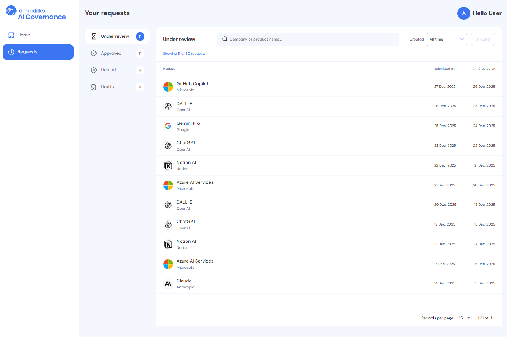

# AI Governance Frontend – Technical Assessment

This repository contains a small, self-contained frontend application used as part of our hiring process at Armadillex.

It represents a simplified version of a real product environment: you'll find existing code, existing decisions, and a few rough edges - similar to what you'd encounter when joining an active team rather than starting something from scratch.

You're not expected to understand every detail of this codebase or be deeply familiar with every library used here.
What we do expect is that you can apply your existing frontend knowledge and preferences to an unfamiliar system, understand the role each tool and technology plays, and reason about how the pieces fit together to support real product flows.

As you work through the code, feel free to lean on your own experience: notice what feels familiar, what feels surprising, and where you'd make different choices. Those observations - and how you justify them - are exactly what we're interested in discussing.

## What You're Looking At

The application is built with Vue 3 and shows a basic “requests” flow:

- A page that lists requests/tickets
- Filtering by text, date and status
- Selecting a request opens a details drawer
- Data is fetched through a mocked API with simulated network delays

There's no backend and no authentication.
Everything you see is intentionally limited to keep the focus on frontend concerns.



## Tech Stack

- **[Vue 3](https://vuejs.org/)** (Composition API, `<script setup>`)
- **[Quasar Framework](https://quasar.dev/)** (UI components, build tooling)
- **[Pinia](https://pinia.vuejs.org/)** (client state: filters, UI state)
- **[TanStack Vue Query](https://tanstack.com/query/latest/docs/framework/vue/overview)** (server state: data fetching, caching)
- **[SCSS](https://sass-lang.com/)** (styles)

## Run Locally

```bash
npm install
npm run dev
```

Runs at `http://localhost:9000`. Navigate to the **Requests** page to see the main functionality.

---

## Project Structure

```
src/
├── pages/
│   └── TicketIndex.vue         # Main requests page
├── components/
│   ├── ticket/
│   │   ├── index/              # List view (table, filters, nav)
│   │   └── details/            # Details drawer (tabs, info display)
│   └── common/                 # Reusable UI components
├── stores/
│   └── ticket/                 # Pinia store
│       └── index.js            ← FOCUS OF PART 1
├── composables/
│   └── ticket/                 # Vue Query hooks
├── services/
│   ├── api/                    # API calls (mock data)
│   ├── helpers/                # Data transformation and UI helper functions
│   └── consts/                 # Constants
└── router/                     # Vue Router config
```

---

## Assignment Overview

**Time expectation:** Approx 3 hours~

Please clone this repository locally.
If you choose to make changes or add comments, feel free to do so in whatever format you're most comfortable with.

---

## Part 1: Code Review – Filtering Flow (use up to 2/3 of the time)

### Context

The Requests page includes filtering functionality (text search, date range, directory/status).
You'll likely touch several areas of the codebase while reviewing this, including:

- `src/components/ticket/index/TicketFilter.vue` – filter UI component
- `src/stores/ticket/index.js` – Pinia store managing state
- `src/components/ticket/index/TicketTable.vue` – table displaying filtered results
- `src/services/ticket/ticket.service.js` – Vue Query hook

### Your Task

**Focus your code review primarily on `src/stores/ticket/index.js`, but feel free to reference related components or composables where relevant.**

Provide a short written code review as if you were reviewing a teammate's work.

Your review should touch on:

1. **What works well**
   - What patterns or decisions do you like? What is done correctly?

2. **What could be improved**
   - For each issue you encounter - What is it? Why does it matter? What would be a better approach for this?
   - You can mention UX observations that impact the code, but keep the focus on architecture/state/data flow.

3. **Questions you have**
   - What's unclear or confusing about the current implementation?

This review should stay focused and lightweight - we're more interested in your thinking than in a comprehensive analysis or review.
Go as deep as feels useful, but don't worry about covering everything.
If there are areas you'd rather discuss live, feel free to leave them for the follow-up conversation.

**Deliverable options**

Please deliever the code review in any way that is comftorable for you. A document, comments in the code, a pull request or any other way - All are accepted.

---

## Part 2: Feature Design – Navigatable Drawer (use the remaining time)

### Current State

When you click a ticket row, a drawer opens on the right showing ticket details.

- Uses local component state only
- Is not URL-based (can't bookmark or share)
- Has 2 tabs (Information, Details)

You'll likely touch several areas of the codebase while reviewing this, including:

- `src/composables/ticket/useTicketQuery.js` – Vue Query hook
- `src/components/ticket/details/TicketDrawer.vue` – Main Drawer component
- `src/components/ticket/details/TicketDetailsTabs.vue` – Tabbed view showing different sections of the ticket

### Your Task

**Plan how to make the drawer URL-navigatable and extensible**

Consider how you would evolve this drawer to behave like a navigable part of the application:

- Tickets should be **shareable via URL**
- Support **browser back/forward** navigation
- Support **deep linking** (visiting the URL directly should open the correct drawer)

**Deliverable options** (choose one):

**Option A: Written Plan**
Submit a short written plan describing your approach and trade-offs in any way that is comftorable for you.

**Option B: Code Proof-of-Concept(POC)**
Submit a small proof-of-concept in code, if that helps explain your thinking

---

## Helpful Context

- **Data source & async behavior**
  There's no real backend. All data goes through `src/services/api/ticket.service.js`, which returns mocked data with artificial delays. Treat it as a real API when reasoning about loading states, errors, and data freshness.

- **Server Data & UI State**
  Requests data is fetched using Vue Query (`src/composables/ticket/useTicketsQuery.js`) and is accessed through the Pinia store (`src/stores/ticket/index.js`), which also holds filters and other UI-related state.

- **Filtering & grouping logic**
  Ticket(request) statuses are : `opened`, `processing`, `closed`
  Directory groups them by :`drafts`, `in-review`, `approved`, `denied`

- **Incomplete by design**
  The code reflects a working but evolving state. Some decisions are debatable, some are incomplete - treat this as a real codebase you joined mid-stream, not something to perfect.

---

**Questions?**

Feel free to note assumptions in your submission or to reach out at any time.
Good luck!

---

Copyright © 2025 Armadillex
